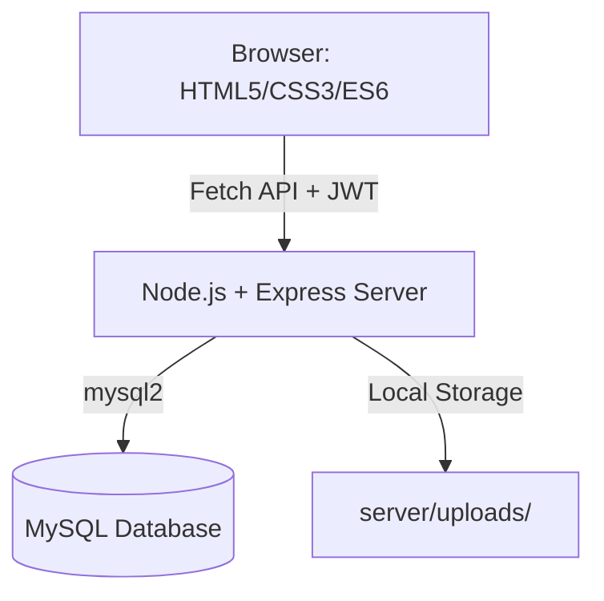

# 👗 Maadhivs Boutique — E-Commerce Platform

[](https://nodejs.org/)
[](https://opensource.org/licenses/ISC)
[](https://www.mysql.com/)

A high-end, full-stack luxury fashion e-commerce platform. Built with a responsive vanilla JavaScript frontend and a robust Node.js + Express backend, featuring a comprehensive administrative dashboard for complete business management.

---

## ✨ Key Features

### 🛍️ Customer Experience
- **Responsive Design**: Fully optimized for mobile, tablet, and desktop viewing.
- **Dynamic Catalog**: Real-time product filtering by categories and subcategories.
- **Persistent Cart & Wishlist**: Save items across sessions using browser local storage.
- **Seamless Checkout**: Streamlined ordering process with shipping address validation.
- **Product Discovery**: Advanced search functionality with custom keyword mapping.

### ⚙️ Administrative Dashboard
- **Inventory Management**: Full CRUD operations for products, including multi-image uploads.
- **Category Control**: Manage hierarchical categories (Men/Women/General) and subcategories.
- **Order Tracking**: Monitor and update order statuses (Pending/Shipped/Delivered).
- **Homepage Customization**: Manage hero sliders, trending products, and popular collections.
- **Secure Access**: JWT-based authentication with bcrypt password hashing.

---

## 🏗️ System Architecture



<details>
<summary><b>View Detailed ASCII Diagram</b></summary>

```
┌──────────────────────────────────────────────────────────────────────┐
│                         BROWSER (Client)                             │
│                                                                      │
│  ┌─────────────────────┐         ┌──────────────────────────────┐   │
│  │   Customer Website   │         │       Admin Panel             │   │
│  │                     │         │                              │   │
│  │  index.html         │         │  admin/index.html  (Login)   │   │
│  │  shop.html          │         │  admin/dashboard.html        │   │
│  │  product.html       │         │  admin/products.html         │   │
│  │  cart.html          │         │  admin/categories.html       │   │
│  │  checkout.html      │         │  admin/orders.html           │   │
│  │  wishlist.html      │         │                              │   │
│  │                     │         │  JS: auth.js                 │   │
│  │  JS: main.js        │         │      data-service.js         │   │
│  │      admin-data-    │         │      products-admin.js       │   │
│  │      bridge.js      │         │      categories-admin.js     │   │
│  │      product.js     │         │      orders-admin.js         │   │
│  │      cart.js         │         │      dashboard.js            │   │
│  └────────┬────────────┘         └──────────────┬───────────────┘   │
│           │ fetch()                              │ fetch() + JWT     │
└───────────┼──────────────────────────────────────┼───────────────────┘
            │                                      │
            ▼                                      ▼
┌──────────────────────────────────────────────────────────────────────┐
│                    NODE.JS SERVER (Express)                           │
│                    http://localhost:5000                              │
└──────────────────────────────┬───────────────────────────────────────┘
                               │ mysql2
                               ▼
┌──────────────────────────────────────────────────────────────────────┐
│                      MySQL DATABASE                                  │
└──────────────────────────────────────────────────────────────────────┘
```
</details>

---

## 🛠️ Tech Stack

### Frontend
- **HTML5 / CSS3**: Semantic structure and modern styling.
- **JavaScript (ES6+)**: Pure JS for interactivity (no heavy frameworks).
- **Fetch API**: For asynchronous communication with the backend.
- **LocalStorage**: Client-side state persistence.

### Backend
- **Node.js**: Scalable runtime environment.
- **Express.js**: Lightweight web framework for API routing.
- **JWT**: Secure authentication for administrative actions.
- **Multer**: Efficient handling of multi-part image uploads.

### Database
- **MySQL**: Relational data storage for products, orders, and users.

---

## 🚀 Quick Start Guide

For detailed system requirements and alternative installation methods, please refer to the **[Dependencies Guide](dependencies.md)**.

### 1. Database Setup
1. Start MySQL (via XAMPP or standalone).
2. Create a database named `maadhivs_boutique`.
3. Import the schema:
   ```bash
   mysql -u root maadhivs_boutique < server/schema.sql
   ```

### 2. Environment Configuration
```bash
cd server
cp .env.example .env
# Edit .env and set your DB credentials and a strong JWT_SECRET
```

### 3. Installation & Launch
```bash
cd server
npm install
npm start
```

### 4. Access URLs
- **Main Website**: [http://localhost:5000](http://localhost:5000)
- **Admin Panel**: [http://localhost:5000/admin/](http://localhost:5000/admin/)
  - *Default Credentials*: `admin@maadhivs.com` / `Admin@123`

---

## 📁 Project Structure

```text
maadhivs-boutique/
├── 📄 *.html             # Client-facing pages (index, shop, cart, etc.)
├── 📁 css/               # Modular stylesheets
├── 📁 js/                # Client-side logic and API bridges
├── 📁 admin/             # Administrative dashboard files
└── 📁 server/            # Backend Node.js application
    ├── 📁 controllers/   # Business logic
    ├── 📁 routes/        # API endpoint definitions
    ├── 📁 middleware/    # Auth & security handlers
    ├── 📄 server.js      # Entry point
    └── 📄 schema.sql     # Database definition
```

---

## 🛡️ Security Features
- **Bcrypt Hashing**: Passwords are never stored in plain text.
- **JWT Guards**: Protected routes require valid bearer tokens.
- **Multer Validation**: Strict file size and type limits for uploads.
- **SQL Injection Protection**: Prepared statements via `mysql2/promise`.

---

## 🤝 Support & Contribution
For issues or feature requests, please check the existing documentation or contact the development team.

---
© 2026 Maadhivs Boutique. All rights reserved.
